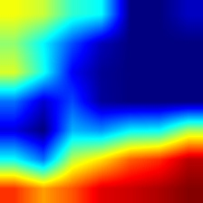
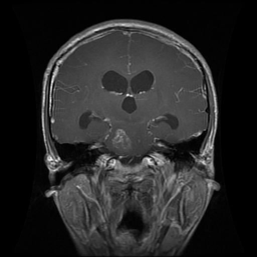
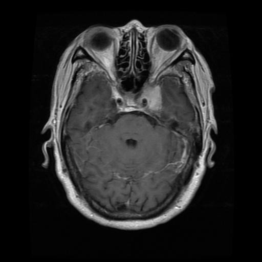
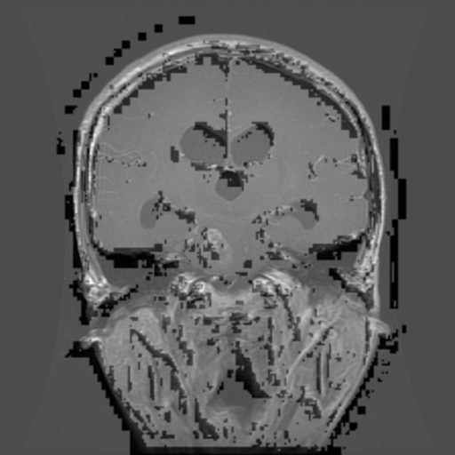
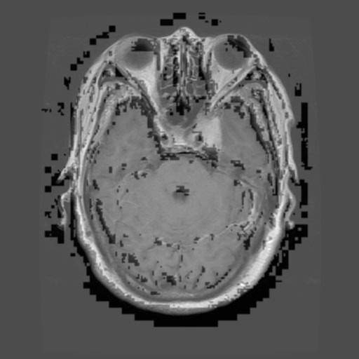

# Neuro-Nova

Neuro-Nova is a Flask-based brain tumor analysis app that classifies MRI scans into Glioma, Meningioma, No Tumor, or Pituitary, then generates Grad-CAM visualizations and segmentation masks.

## Features

- MRI upload workflow with login, dashboard, and result pages
- CNN-based tumor classification
- Grad-CAM heatmap generation
- Segmentation mask output
- Web UI built with Flask, HTML, CSS, and JavaScript

## Tech Stack

- Python 3.11+
- Flask
- TensorFlow / Keras
- OpenCV
- NumPy
- Pillow

## Project Structure

- `app.py` - Flask application and routes
- `ml/` - preprocessing, classification, Grad-CAM, and segmentation helpers
- `models/` - saved ML models and class index metadata
- `templates/` - HTML templates for the web UI
- `static/images/` - generated sample output images
- `dataset/` - training dataset

## Setup

1. Create and activate a virtual environment.
2. Install dependencies:

```bash
pip install -r requirements.txt
```

3. Run the app:

```bash
python app.py
```

4. Open the local server in your browser.

## Usage

1. Sign in through the login page.
2. Open the dashboard.
3. Upload an MRI image.
4. Review the predicted class, confidence, Grad-CAM heatmap, and segmentation output.

## Sample Outputs

The repository includes generated examples in `static/images/`. These are the same kinds of outputs shown on the result page.

### Grad-CAM Examples







### Segmentation Examples






## Notes

- The demo authentication in `app.py` is intentionally simple.
- Some outputs are fallback visualizations when a full model path is unavailable at runtime.
- Additional generated outputs are available in `static/images/`.
